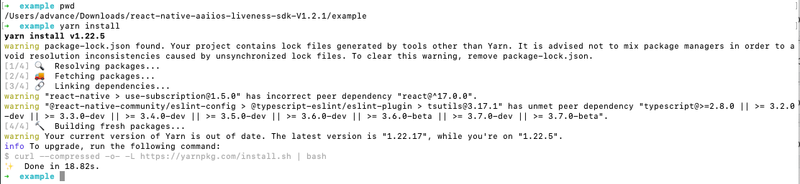
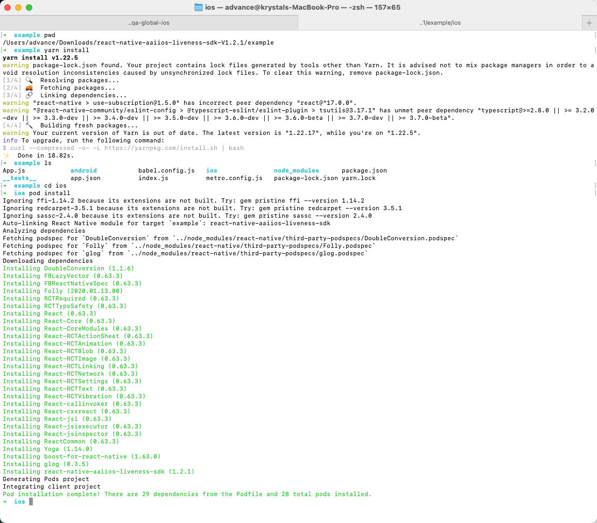
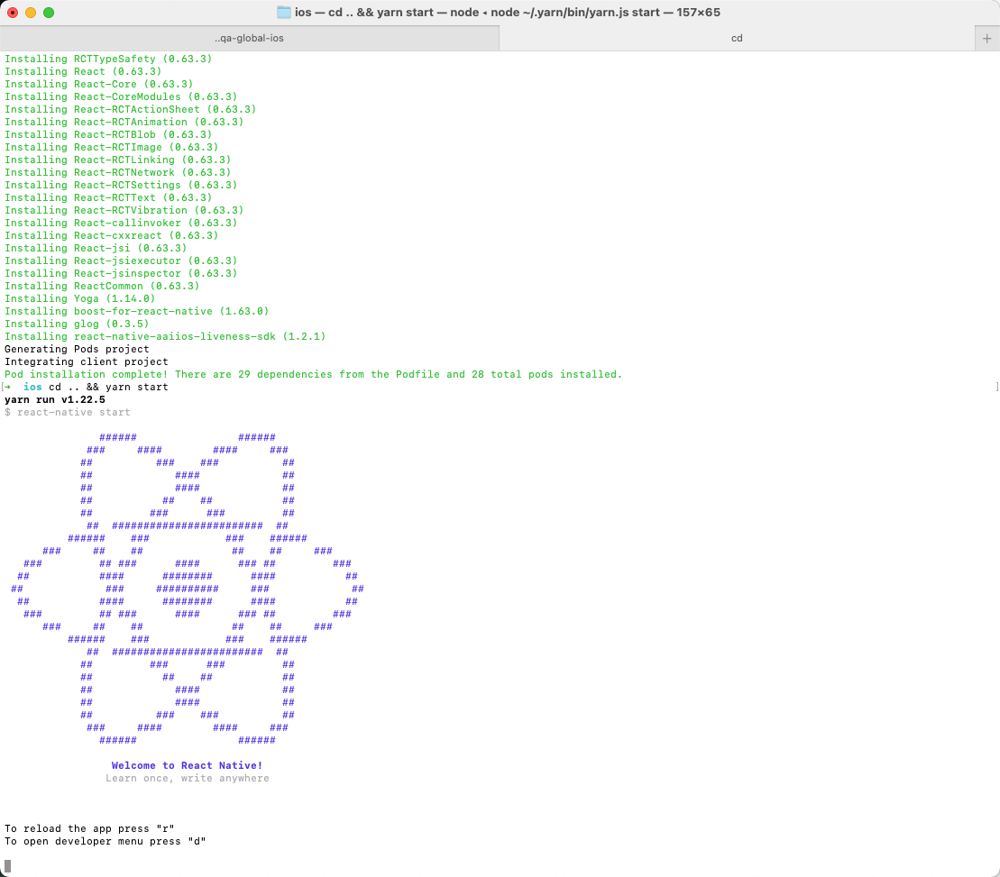
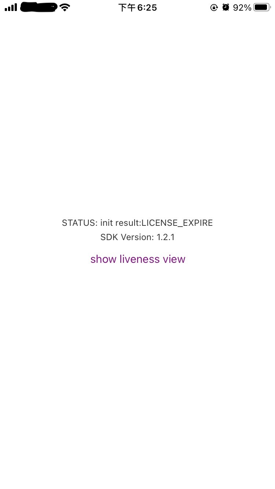
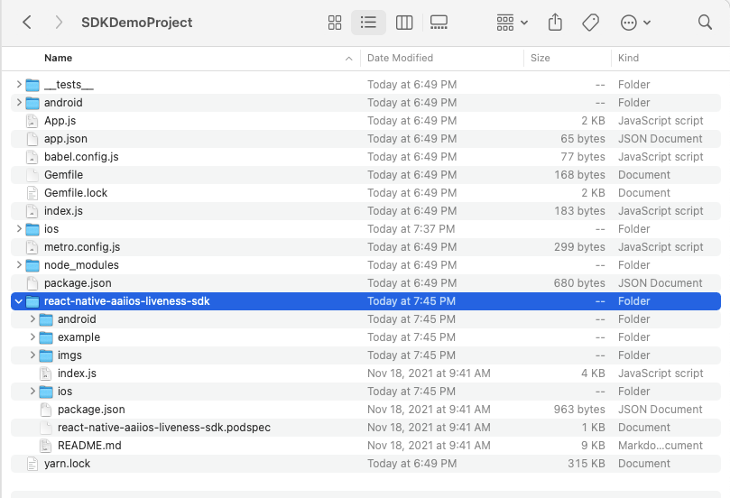
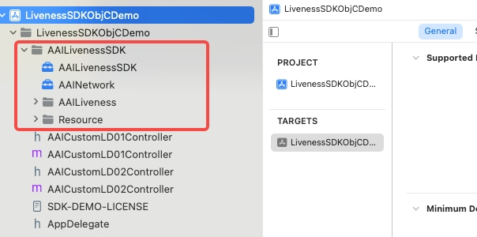
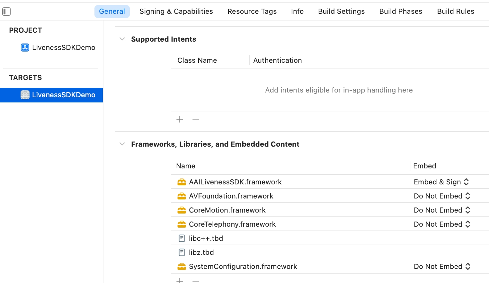

## react-native-aaiios-liveness-sdk(v3.1.1)

### Migration Guides
1. From version 3.0.0, motion detection has been removed, so the properties and methods related to motion detection will not have any effect.
2. From v2.0.1, we refactored the code and aligned most of the js api with the android side, so please refer to the table below when migrating from the old version to v2.0.1.
    | old method name | new method name |
    | ------ | ------ |
    | NativeModules.RNAAILivenessSDK.initWithMarket("your-market") | AAIIOSLivenessSDK.initSDKByLicense("your-market", false) |
    | NativeModules.RNAAILivenessSDK.initWithMarketAndGlobalService("your-market", isGlobalService) | AAIIOSLivenessSDK.initSDKByLicense("your-market", isGlobalService) |
    | NativeModules.RNAAILivenessSDK.init("your-access-key", "your-secret-key", "your-market") | AAIIOSLivenessSDK.initSDKByKey("your-access-key", "your-secret-key", "your-market", false) |
    | NativeModules.RNAAILivenessSDK.configDetectOcclusion(true) | AAIIOSLivenessSDK.setDetectOcclusion(true) |
    | NativeModules.RNAAILivenessSDK.configResultPictureSize(600) | AAIIOSLivenessSDK.setResultPictureSize(600) |
    | NativeModules.RNAAILivenessSDK.configUserId("your-reference-id") | AAIIOSLivenessSDK.bindUser("your-reference-id") |
    | NativeModules.RNAAILivenessSDK.configActionTimeoutSeconds(10) | AAIIOSLivenessSDK.setActionTimeoutSeconds(10) |
### Download SDK
  See [this part](#change-logs-and-release-history) to get SDK download link.

### Running the example app

1. Download SDK and extract it, then go into the example directory:
    `cd example`
2. Install packages:
    `yarn install`
    <div></div>
3. Go into the `ios` subdirectory and install pod dependencies:
    `cd ios && pod install`
    <div></div>
4. Go into the example directory and start Metro:
    `cd .. && yarn start`
    <div></div>
5. Modify `example/App.js` to specify your market and license content(The license content is obtained by your server calling our openapi).
   ```
   AAIIOSLivenessSDK.initSDKByLicense("AAILivenessMarketIndonesia", false)
   let licenseStr = 'your-license-str'
   AAIIOSLivenessSDK.setLicenseAndCheck(licenseStr, (result) => {
     ...
   })
   ```
6. run example app:
    `react-native run-ios` or open `example.xcworkspace` in Xcode and run.
    <div></div>

### Getting started
#### Getting started (react-native >= 0.60)

If your react-navive version >= 0.60, you can refer this part to intergrate `react-native-aaiios-liveness-sdk`.

1. First rename the folder name `react-native-aaiios-liveness-sdk-V{sdkversion}` to `react-native-aaiios-liveness-sdk`, then we can try to integrate the SDK. There are two ways to integrate the SDK:
 
    * As local package:
      1. Put the `react-native-aaiios-liveness-sdk` folder to your react-native project.
        <div></div>

      2. cd your react-native project root path and link this local sdk package.
        `yarn add link:./react-native-aaiios-liveness-sdk`

    * As remote package:
      1. Upload all files in `react-native-aaiios-liveness-sdk` folder to your private git repository, make sure the name of your repository is `react-native-aaiios-liveness-sdk`.
      2. Navigate to the root directory of your react-native project and install SDK.
        `$ npm install git+ssh://git@{your-git-domain}:{your-git-user-name}/react-native-aaiios-liveness-sdk.git --save`

2. Add pod dependencies `AAINetwork` and `AAILiveness` to your `Podfile`:
    ```Ruby
    target 'example' do
      config = use_native_modules!

      use_react_native!(:path => config["reactNativePath"])

      ...
      
      pod 'AAINetwork', :http => 'https://prod-guardian-cv.oss-ap-southeast-5.aliyuncs.com/sdk/iOS-libraries/AAINetwork/AAINetwork-V1.0.2.tar.bz2', type: :tbz 
      pod 'AAILiveness', :http => 'https://prod-guardian-cv.oss-ap-southeast-5.aliyuncs.com/sdk/iOS-liveness-detection/3.1.1/iOS-Liveness-SDK-V3.1.1.tar.bz2', type: :tbz

    end
    ```
3. After integrate the SDK then we link SDK to iOS project.

    `cd ios && pod install`
    <div></div>

4. Then add camera and motion sensor (gyroscope) usage description in `Info.plist` as bellow. Ignore this step if you have added those.
   
   ```xml
   <key>NSCameraUsageDescription</key>
   <string>Use the camera to detect the face movements</string>
   <key>NSMotionUsageDescription</key>
   <string>Use the motion sensor to get the phone orientation</string>
   ```

#### Getting started (react-native < 0.60)

1. Download the [AAILivenessSDK](https://prod-guardian-cv.oss-ap-southeast-5.aliyuncs.com/sdk/iOS-liveness-detection/3.1.1/iOS-Liveness-SDK-V3.1.1.tar.bz2) and [AAINetwork](https://prod-guardian-cv.oss-ap-southeast-5.aliyuncs.com/sdk/iOS-libraries/AAINetwork/AAINetwork-V1.0.2.tar.bz2), then extract them and add `AAILivenessSDK` folder, `AAINetwork.xcframework` to your project:
    
    <div></div>
2. Add the `RNLivenessPlugin` folder to your project.
3. In Xcode, choose "TARGETS -> General" add the following system libraries and frameworks in the `Frameworks, Libraries, and Embedded Content` section:
   - `libz.tbd`
   - `libc++.tbd`
   - `libresolv.9.tbd`
   - `AVFoundation.framework`
   - `CoreMotion.framework`
   - `SystemConfiguration.framework`
   - `CoreTelephony.framework`
   - `Accelerate.framework`
   - `Metal.framework`
   - `MetalKit.framework`

<div></div>

4. Add `-ObjC` to the other linker flag in the project configuration.

5. In Xcode, add camera and motion sensor (gyroscope) usage description in `Info.plist` as bellow. Ignore this step if you have added those.
   
   ```xml
   <key>NSCameraUsageDescription</key>
   <string>Use the camera to detect the face movements</string>
   <key>NSMotionUsageDescription</key>
   <string>Use the motion sensor to get the phone orientation</string>
   ```

6. Rename `index.js` to `AAIIOSLivenessSDK.js`, then add this `js` file to your react native project.

### Usage

```javascript
import AAIIOSLivenessSDK from 'react-native-aaiios-liveness-sdk';
// Import SDK (react-native < 0.60)
//import AAIIOSLivenessSDK from '{your AAIIOSLivenessSDK.js path}';

  SDKTest() {
    /*
    /// Optional 
    // Get SDK version
    AAIIOSLivenessSDK.sdkVersion((message) => {
      console.log("SDK version is ", message)
    });
    */

    // Step 1. Initialize SDK
    // The last boolean value represents whether the Global service is enabled or not, and is set to true if it is, or false if it is not.
    // Market available value are as follows:
    // AAILivenessMarketIndonesia
    // AAILivenessMarketIndia
    // AAILivenessMarketPhilippines
    // AAILivenessMarketVietnam
    // AAILivenessMarketThailand
    // AAILivenessMarketMexico
    // AAILivenessMarketMalaysia
    // AAILivenessMarketPakistan
    // AAILivenessMarketNigeria
    // AAILivenessMarketColombia
    // AAILivenessMarketSingapore
    // AAILivenessMarketBPS
    AAIIOSLivenessSDK.initSDKByLicense("AAILivenessMarketIndonesia", false)

    /*
    /// Optional 
    // Configure SDK detection level
    // Available levels are "EASY", "NORMAL", "HARD". Default is "NORMAL".
    // Note that this method must be called before "setLicenseAndCheck", otherwise it won't take effect.
    AAIIOSLivenessSDK.setDetectionLevel("NORMAL")
    */

    /*
    /// Optional 
    // Set wheher to detect occlusion. Default is false.
    AAIIOSLivenessSDK.setDetectOcclusion(true)
    */

    /*
    /// Optional 
    // Set the size(width) of output `img` in `onDetectionComplete`. 
    // Image size(width) should be in range [300, 1000], default image size(width) is 600(600x600).
    AAIIOSLivenessSDK.setResultPictureSize(600)
    */

    /*
    /// Optional
    // User binding (strongly recommended).
    // You can use this method to pass your user unique identifier to us, 
    // we will establish a mapping relationship based on the identifier。
    // It is helpful for us to check the log when encountering problems.
    AAIIOSLivenessSDK.bindUser("your-reference-id")
    */

    // Step 2. Configure your license(your server needs to call openAPI to obtain license content)
    AAIIOSLivenessSDK.setLicenseAndCheck("your-license-content", (result) => {
      if (result === "SUCCESS") {
        showSDKPage()
      } else {
        console.log("setLicenseAndCheck failed:", result)
      }
    })

  }

  showSDKPage() {
    var config = {
      /*
      /// Optional
      showHUD: true,
      */

      /*
      /// Optional
      /// Specify which language to use for the SDK. If this value is not set,
      /// the system language will be used by default. If the system language is not supported,
      /// English will be used.
      ///
      /// The languages currently supported by sdk are as follows:
      /// 
      /// "en" "id"  "vi"  "zh-Hans"  "th"  "es"  "ms" "hi"
      language: "en",
      */

      /*
      /// Optional (Note from v3.0.4, this configuration item has been deprecated, please use `timeoutDurationOf3DMode` instead)
      /// Set the timeout for prepare stage, default is 50s.
      prepareTimeoutInterval: 50,
      */

      /*
      /// Optional
      /// Set the detection timeout duration of 3D mode(near/distant mode), the range of value should be [10, 60], default is 50s.
      /// If the detection cannot pass within this time duration,  the `onDetectionFailed` will be called,
      /// and the value of the "errorCode" is "fail_reason_prepare_timeout".
      ///
      /// @note This time duration does not include network request duration.
      ///
      timeoutDurationOf3DMode: 50,
      */

      /*
      /// Optional
      // Whether to animate the presentation. Default is true.
      animated: true,
      */
    
     /*
      /// Optional
      // Whether to allow to play prompt audio. Default is true.
      playPromptAudio: true,
      */

     /*
      /// The color of the ellipse border in 3D mode(near/distant mode). Default is 0x5CC414.
      ellipseBorderCol3D: "#0000FF",
      */

     /*
      /// The color of the inner ellipse animation line of the 3D mode(near/distant mode). Default is 0x5CC414.
      innerEllipseLineCol3D: "#FF0000",
      */
    }

    // Step 3. Configure callback
    var callbackMap = {
      // Optional
      onCameraPermissionDenied: (errorKey, errorMessage) => {
        console.log(">>>>> onCameraPermissionDenied", errorKey, errorMessage)
        this.setState({message: errorMessage})
      },

      // Optional
      /*
      For `livenessViewBeginRequest` and `livenessViewEndRequest`, 
      these two methods are only used to tell you that the SDK is going to start sending network requests and end network requests, 
      and are usually used to display and close the loadingView, that is, if you pass showHUD: false, then you should in method `livenessViewBeginRequest` to show your customized loading view
      and close loading view in method `livenessViewEndRequest`. If you pass showHUD: true, then you do nothing in these two methods.
      */
      livenessViewBeginRequest: () => {
        console.log(">>>>> livenessViewBeginRequest")
      },

      // Optional
      livenessViewEndRequest: () => {
        console.log(">>>>> livenessViewEndRequest")
      },

      // Required
      onDetectionComplete: (livenessId, base64Img) => {
        console.log(">>>>> onDetectionComplete:", livenessId)
         /*
          You need to give the livenessId to your server, then your server will call the anti-spoofing api to get the score of this image.
          The base64Img size is 600x600.
          */
         this.setState({message: livenessId})
      },

      // Optional 
      /*
      The error types are as follows, and the corresponding error messages are in the language file of the `Resource/AAILanguageString.bundle/id.lproj/Localizable.strings` (depending on the language used by the phone)

      fail_reason_prepare_timeout
      fail_reason_timeout
      fail_reason_muti_face
      fail_reason_facemiss_blink_mouth
      fail_reason_facemiss_pos_yaw
      fail_reason_much_action

      In fact, for the type of error this function gets, you don't need to pay attention to it, just prompt the error message and let the user retry.
      */
      onDetectionFailed: (errorCode, errorMessage) => {
        console.log(">>>>> onDetectionFailed:", errorCode, errorMessage)
        this.setState({message: errorMessage})
      },

      // Optional 
      /*
      This means sdk request failed, it may be that the network is not available, or account problems, or server errors, etc. 
      You only need to pay attention to the `errorMessage` and `transactionId`, `transactionId` can be used to help debug the specific cause of the error, generally just prompt the errorMessage.
      */
      onLivenessViewRequestFailed: (errorCode, errorMessage, transactionId) => {
        console.log(">>>>> onLivenessViewRequestFailed:", errorCode, errorMessage, transactionId)
        this.setState({message: errorMessage})
      },

      // Optional 
      // This means that the user tapped the back button during liveness detection.
      onGiveUp: () => {
        console.log(">>>>> onGiveUp")
        this.setState({message: "onGiveUp"})
      }
    }

    AAIIOSLivenessSDK.startLiveness(config, callback)
  }

```

### Change logs and release history

#### v3.1.1 [Download](https://prod-guardian-cv.oss-ap-southeast-5.aliyuncs.com/sdk/iOS-liveness-detection/3.1.1/react-native-aaiios-liveness-sdk-V3.1.1.zip)
1. Sync native SDK.

#### v3.1.0 [Download](https://prod-guardian-cv.oss-ap-southeast-5.aliyuncs.com/sdk/iOS-liveness-detection/3.1.0/react-native-aaiios-liveness-sdk-V3.1.0.zip)
1. Sync native SDK.

#### v3.0.7 [Download](https://prod-guardian-cv.oss-ap-southeast-5.aliyuncs.com/sdk/iOS-liveness-detection/3.0.7/react-native-aaiios-liveness-sdk-V3.0.7.zip)
1. Sync native SDK.
2. Support "AAILivenessMarketBPS".

#### v3.0.5 [Download](https://prod-guardian-cv.oss-ap-southeast-5.aliyuncs.com/sdk/iOS-liveness-detection/3.0.5/react-native-aaiios-liveness-sdk-V3.0.5.zip)
1. Sync native SDK.
2. Upgrade AAINetwork module to 1.0.2.

#### v3.0.4 [Download](https://prod-guardian-cv.oss-ap-southeast-5.aliyuncs.com/sdk/iOS-liveness-detection/3.0.4/react-native-aaiios-liveness-sdk-V3.0.4.zip)
1. Sync native SDK.
2. Deprecate the `prepareTimeoutInterval`, please use `timeoutDurationOf3DMode` instead.

#### v3.0.3 [Download](https://prod-guardian-cv.oss-ap-southeast-5.aliyuncs.com/sdk/iOS-liveness-detection/3.0.3/react-native-aaiios-liveness-sdk-V3.0.3.zip)
1. Sync native SDK.

#### v3.0.2 [Download](https://prod-guardian-cv.oss-ap-southeast-5.aliyuncs.com/sdk/iOS-liveness-detection/3.0.2/react-native-aaiios-liveness-sdk-V3.0.2.zip)
1. Sync native SDK.

#### v3.0.0 [Download](https://prod-guardian-cv.oss-ap-southeast-5.aliyuncs.com/sdk/iOS-liveness-detection/3.0.0/react-native-aaiios-liveness-sdk-V3.0.0.zip)
1. Sync native SDK.
2. From version 3.0.0, motion detection has been removed, so the properties and methods related to motion detection will not have any effect.

#### v2.0.7 [Download](https://prod-guardian-cv.oss-ap-southeast-5.aliyuncs.com/sdk/iOS-liveness-detection/2.0.7/react-native-aaiios-liveness-sdk-V2.0.7.zip)
1. Sync native SDK.

#### v2.0.6 [Download](https://prod-guardian-cv.oss-ap-southeast-5.aliyuncs.com/sdk/iOS-liveness-detection/2.0.6/react-native-aaiios-liveness-sdk-V2.0.6.zip)
1. Sync native SDK.

#### v2.0.5 [Download](https://prod-guardian-cv.oss-ap-southeast-5.aliyuncs.com/sdk/iOS-liveness-detection/2.0.5/react-native-aaiios-liveness-sdk-V2.0.5.zip)
1. Sync native SDK.

#### v2.0.4 [Download](https://prod-guardian-cv.oss-ap-southeast-5.aliyuncs.com/sdk/iOS-liveness-detection/2.0.4/react-native-aaiios-liveness-sdk-V2.0.4.zip)
1. Sync native SDK.
2. Add configuration items `playPromptAudio` and `showAnimationImgs`.

#### v2.0.3 [Download](https://prod-guardian-cv.oss-ap-southeast-5.aliyuncs.com/sdk/iOS-liveness-detection/2.0.3/react-native-aaiios-liveness-sdk-V2.0.3.zip)
1. Sync native SDK.

#### v2.0.2 [Download](https://prod-guardian-cv.oss-ap-southeast-5.aliyuncs.com/sdk/iOS-liveness-detection/2.0.2/react-native-aaiios-liveness-sdk-V2.0.2.zip)
1. Sync native SDK.

#### v2.0.1 [Download](https://prod-guardian-cv.oss-ap-southeast-5.aliyuncs.com/sdk/iOS-liveness-detection/2.0.1/react-native-aaiios-liveness-sdk-V2.0.1.zip)
1. Refactored the code.

#### v1.3.4 [Download](https://prod-guardian-cv.oss-ap-southeast-5.aliyuncs.com/sdk/iOS-liveness-detection/1.3.4/react-native-aaiios-liveness-sdk-V1.3.4.zip)
1. Fix bugs.

#### v1.3.3 [Download](https://prod-guardian-cv.oss-ap-southeast-5.aliyuncs.com/sdk/iOS-liveness-detection/1.3.3/react-native-aaiios-liveness-sdk-V1.3.3.zip)
1. Optimizing the capture of face image.
2. Support closed eye detection.
3. Add localized string "pls_open_eye".
4. Fix EXC_BAD_ACCESS bug that could occur in some cases.
5. Fix the global service bug.
6. Compressed images of AAIImgs.bundle.
7. Removed 'android' folder.

#### v1.2.9.1 [Download](https://prod-guardian-cv.oss-ap-southeast-5.aliyuncs.com/sdk/iOS-liveness-detection/1.2.9.1/react-native-aaiios-liveness-sdk-V1.2.9.1.zip)
1. Fixed the bug that the audio could not be automatically switched with the language.

#### v1.2.9 [Download](https://prod-guardian-cv.oss-ap-southeast-5.aliyuncs.com/sdk/iOS-liveness-detection/1.2.9/react-native-aaiios-liveness-sdk-V1.2.9.zip)
1. Support setting `language` and `prepareTimeoutInterval`.

#### v1.2.8 [Download](https://prod-guardian-cv.oss-ap-southeast-5.aliyuncs.com/sdk/iOS-liveness-detection/1.2.8/react-native-aaiios-liveness-sdk-V1.2.8.zip)
1. Upgrade network module.

#### v1.2.1 [Download](https://prod-guardian-cv.oss-ap-southeast-5.aliyuncs.com/sdk/iOS-liveness-detection/1.2.1/react-native-aaiios-liveness-sdk-V1.2.1.zip)
1. Fix the bug that img of AAILivenessResult may be nil when the onDetectionComplete: method is called.

#### v1.2.0 [Download](https://prod-guardian-cv.oss-ap-southeast-5.aliyuncs.com/sdk/iOS-liveness-detection/1.2.0/react-native-aaiios-liveness-sdk-V1.2.0.zip)
1. Support to initialize SDK with license.
    ```js
    NativeModules.RNAAILivenessSDK.initWithMarket("your-market")
    
    NativeModules.RNAAILivenessSDK.configLicenseAndCheck("your-license-content", (result) => {
      if (result === "SUCCESS") {
        // SDK init success
      }
    })
    ```
2. Support face occlusion detection(only in the preparation phase, not in the action detection phase), this feature is off by default, you can turn it on if needed.

    ```js
    NativeModules.RNAAILivenessSDK.configDetectOcclusion(true)
    ```
3. Support Mexico,Malaysia,Pakistan,Nigeria,Colombia.